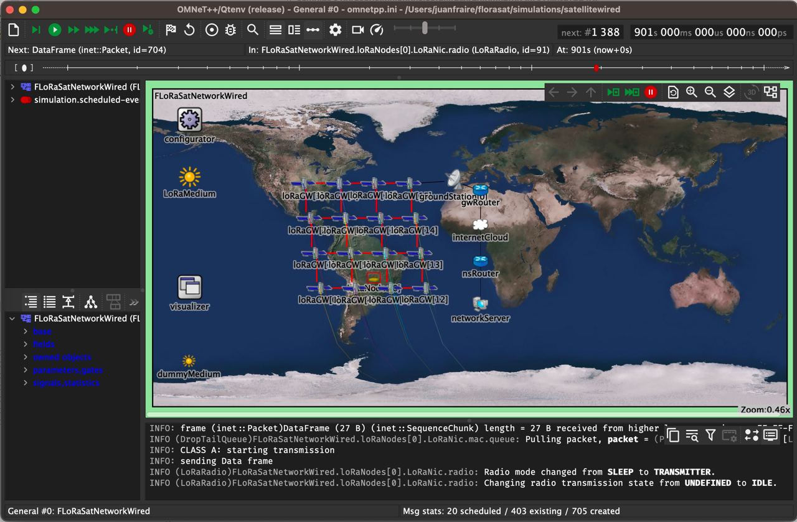

## Our Extended Architecture

This repository extends the original FLoRaSat simulator to support **standard-compliant LoRaWAN Direct-to-Satellite (DtS) communication** and to enable a systematic **MAC layer configuration analysis**.

### Architecture change: co-located Gateway + Network Server on-board the satellite

In the original FLoRaSat architecture, the LoRaWAN Network Server (NS) resides on the ground segment, while the satellite only embeds the Gateway (GW). This requires every uplink packet received by the satellite to be relayed to the ground before it can be processed, and every downlink response (e.g., an acknowledgment) to travel back up to the satellite — introducing additional delay that is incompatible with the strict RX1/RX2 timing constraints of the LoRaWAN specification during a satellite pass.

We modified this architecture by **migrating the Network Server directly on-board the satellite payload**, co-located with the Gateway. This allows the satellite to receive, process, and respond to uplink transmissions (including scheduling acknowledgments) locally, without depending on a ground round-trip — making it possible to respect the LoRaWAN RECEIVE_DELAY1/RECEIVE_DELAY2 windows within a single satellite pass.

### LoRaWAN standard compliance

To align FLoRaSat with the LoRaWAN specification and support a rigorous MAC layer evaluation, we implemented several features that were missing from the original simulator:

- **Multi-channel uplink support**: transmissions now occur across the three mandatory uplink channels (ch0, ch1, ch2), replacing the original single-channel behavior.
- **ACK scheduling during RX1/RX2**: downlink acknowledgments are scheduled in the correct receive windows following each uplink transmission.
- **Retransmission procedure**: a standard-compliant retransmission mechanism with randomized back-off (`NbTrans`, `t_off ∈ [1s, 3s]`) is implemented for both confirmed and unconfirmed traffic.
- **Uplink duty-cycle enforcement**: per-frequency duty-cycle constraints are now enforced at the end-device level (the original implementation only enforced duty-cycle on the downlink/gateway side).
- **Satellite visibility check**: end-devices perform a pre-transmission check (based on elevation angle and slant range) to only transmit when the satellite is within range, isolating collisions as the primary source of packet loss.

### MAC layer configuration analysis

Building on this standard-compliant foundation, we implemented and compared three channel access schemes — **Pure ALOHA**, **CSMA** (Channel Activity Detection-based), and an **adapted Slotted ALOHA (S-ALOHA)** built on LoRaWAN Class B beacon synchronization — each toggled via a configuration flag. We evaluated their performance in terms of **Packet Delivery Ratio (PDR)** and **estimated battery lifetime**, across:

- Network sizes from 20 to 1,000 end-devices
- Confirmed vs. unconfirmed traffic modes
- Multiple retransmission budgets (`NbTrans` = 1, 3, 8)

This analysis identifies the optimal MAC layer configuration (channel access scheme, traffic mode, and `NbTrans`) depending on network scale, for LoRaWAN-based LEO satellite IoT deployments.
---

## Original FLoRaSat

FLoRaSat (Framework for LoRa-based Satellite networks) is an Omnet++ based discrete-event simulator to carry out end-to-end satellite IoT simulations based on LoRa and LoRaWAN adaptations for the space domain. 

A general introduction to the topic is provided in [1]. A description of the early realease of FLoRaSat can be found in [2]. Part of the tool is being developed in the context of the [STEREO](https://project.inria.fr/stereo) ANR project.

- [1] Fraire, Juan A., et al. "[Space-Terrestrial Integrated Internet of Things: Challenges and Opportunities](https://ieeexplore.ieee.org/abstract/document/9887919)." IEEE Communications Magazine (2022).

- [2] Fraire, Juan A., et al. "[Simulating LoRa-Based Direct-to-Satellite IoT Networks with FLoRaSat](https://ieeexplore.ieee.org/abstract/document/9842830)." 2022 IEEE 23rd International Symposium on a World of Wireless, Mobile and Multimedia Networks (WoWMoM). IEEE, 2022.

The FLoRaSat simulator is based on an extended version of [FLoRa](https://flora.aalto.fi/), [leosatellites](https://github.com/Avian688/leosatellites), [OS3](https://github.com/inet-framework/os3), and [INET](https://inet.omnetpp.org/) integrated in a single [Omnet++](https://omnetpp.org/) framework to provide an accurate simulation model for space-terrestrial integrated IoT.

*Please consider the the simulator is under active development, and it should **not** be considered a final stable (or documented) version at the moment. Please reach us at [juan.fraire@inria.fr](juan.fraire@inria.fr) if interested in joining the developers team.* 

Currently, we support a single sample scenario comprising 16 satellites in a grid-like formation (realistic orbital parameters), passing over a circular region with up to 1500 nodes. However, some flexibility can already be leveraged based on the features listed below.

## Features

(UD = Under Development, TD = To-do roadmap)

- **Ground IoT Device**
	- Platform
		- Energy model
		- Clock drift model (TD)
        - Localization model (TD)
    - PHY: LoRa
    	- Free-Space channel model (from INET)
    	- Antena models (from INET: omni, monopole, parabolic, etc.)
    	- Sensitivity model
    	- Doppler effect model (available, but not integrated TD)
    	- Spreading Factors (configurable and fixed per node)
    	- Capture effect (TD)
    - MAC: LoRaWAN
    	- Class A (from FLoRa)
    	- Class B (downlink beacon only, uplink TD)
    	- Class C (TD)
    	- [Class S](https://hal.laas.fr/hal-03694383) (time-slotted Class B extension, downlink beacon only, uplink TD)
    	- [FSA](https://ieeexplore.ieee.org/document/8855903) Frame-Slotted ALOHA Game (leveraging network size estimation)
    	- ADR (TD)
    - MAC/PHY: LR-FHSS (UD)

- **Satellite Gateway**
	- Platform
		- Orbital propagation with SGP4 (LEO and GEO) (from leosatellites)
		- Orbital propagation with SDP4 (GEO) (TD)
		- Support for Keplerian orbital parameters
		- Support for TLE (UD)
		- Attitude control: Nadir-aligned
		- Constellation creation (Walker Star and Walker Delta)
		- EventModule (Scenario scripting, enable/disable ISL at given timestamps)
	- Inter-Satellite Link
		- Cabled (mimick P2P links)
		- Radio (UD, draft version available)
		- Topology control (UD)
		- Dynamic link creation/destruction
			- Constellation-based (constraints: ISL device status, satellite directions, is adjacent sat, latitude)    
			- Contact Plan-based (read from topology file)
		- Dynamic link latency update
	- Routing
		- Generic routing interface (UD)
		- Packet queue and configurable processing delay    
		- Mesh routing 
			- [DisCoRoute](https://ieeexplore.ieee.org/abstract/document/9914716) (UD by R. Ohs)
			- [DDRA](https://ieeexplore.ieee.org/document/7023604) (UD by R. Ohs)    
		- Delay-Tolerant routing 
			- [CGR](https://www.sciencedirect.com/science/article/abs/pii/S1084804520303489) based on Rev 17 from [DtnSim](https://bitbucket.org/lcd-unc-ar/dtnsim) (UD by S. Montoya)
			- Contact Plan generation (TD by S. Montoya)
			- Storage model (UD by S. Montoya)

- **Ground Segment**
	- Ground Station-to-Satellite Link
		- Cabled (mimick P2P links)
		- Radio (TD)
		- Topology control (UD)
			- Dynamic link creation/destruction
			- Constellation-based (constraints: min elevation)   
			- Contact Plan-based (read from topology file)
		- Dynamic link latency update
	- Internet
		- From INET
	- Network Server
		- Lora/LoRaWAN Network server (from FLoRa)

## Installation

1. Install OpenSSL with `sudo apt-get install libssl-dev`

2. Install [OMNeT++6.0.1](https://doc.omnetpp.org/omnetpp/InstallGuide.pdf). Tips:

    * Set the omnetpp environment permanently with `echo '[ -f "$HOME/omnetpp-6.0.1/setenv" ] && source "$HOME/omnetpp-6.0.1/setenv"' >> ~/.profile`

    * Remember to compile with `make -j8` to take advantage of multiple processor cores

    * If **ERROR: /home/diego/omnetpp-6.0.1/bin is not in the path!**, add it by entering `export PATH=$HOME/omnetpp-6.0.1/bin:$PATH`

    * If **ERROR: make: xdg-desktop-menu: No such file or directory** do `sudo apt install xdg-utils`
    
3. Launch omnetpp from the terminal with `omnetpp` and choose a workspace for project (default is `$HOME/omnetpp-6.0.1/samples`)

4. Go to **Help >> Install Simulation Models...** menu and install **INETv4.3.x** in the workspace

5. Clone `https://gitlab.inria.fr/jfraire/florasat.git` in the workspace

6. Add INETv4.3 to the environment by executing florasat/setinet.sh passing the absolute path to the INET root directory, eg. `sh setinet.sh $HOME/omnetpp-6.0.1/samples/inet4.3`

7. In omnetpp go to **File >> Open Projects from File System** and add florasat project to the workspace

8. Right-click florasat project and go to *Properties*, under *Project References* select inet4.3 (only)

9. Finally, right-click florasat and Build Project

  

## Execution

  

Two scenarios are under development:

  

- In `/simulations/satelliteradio` the satellites/gateways use radio modules for inter satellite communication. This functionality does not work yet but it is open for development

  

- In `/simulations/satellitewired` the satellites/gateways use direct links for inter satellite communication
